# 👁️ PANORAMA

> *From streets to summits - AI-powered scene recognition*

[](https://streamlit.io)
[](https://tensorflow.org)
[](https://python.org)

---

## 📊 Architecture at a Glance

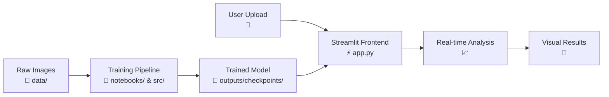

---

## 🔄 Workflow Visualization

### **Phase 1: Training Pipeline**
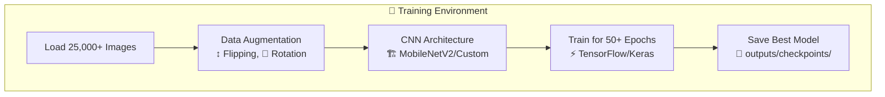

### **Phase 2: Inference Pipeline**
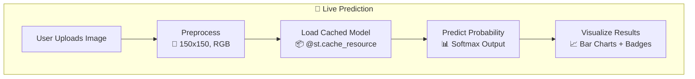

---

## 📁 Project Structure Infographic

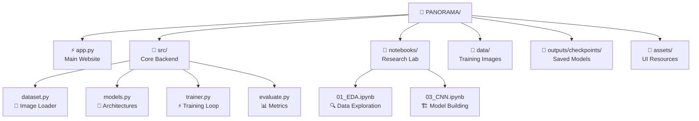

---

## 🎯 Key Features

| Feature | Description | Status |
|---------|-------------|--------|
| **Multi-Model Support** | Switch between CNN & MobileNetV2 | ✅ |
| **Real-time Analysis** | Predictions in <2 seconds | ✅ |
| **Visual Feedback** | Bar charts + confidence badges | ✅ |
| **Class Coverage** | 6 scene categories | ✅ |
| **Glassmorphism UI** | Modern, aesthetic design | ✅ |
| **Error Handling** | Graceful failures | ✅ |

---

## 🧩 Component Breakdown

### **Backend Modules** (`src/`)

```
📁 src/
├── config.py          # 🎛️ Global settings
├── dataset.py         # 📸 Data loading & augmentation
├── models.py          # 🧠 Neural network architectures
├── trainer.py         # ⚡ Training loops
└── evaluate.py        # 📊 Accuracy & loss metrics
```

### **Frontend Features** (`app.py`)

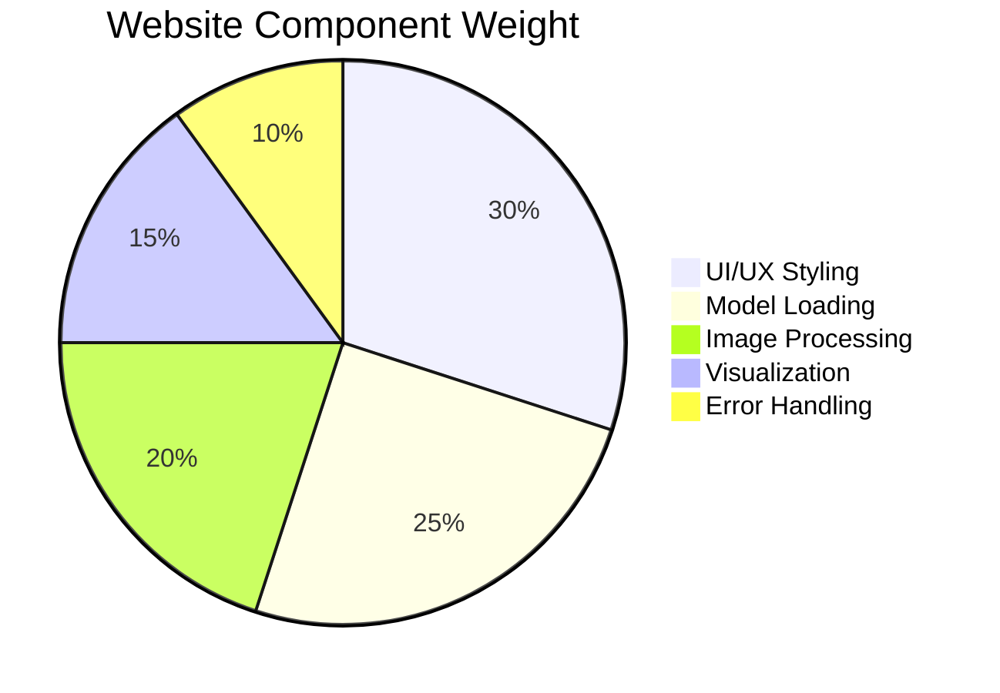

---

## 🚀 Performance Metrics

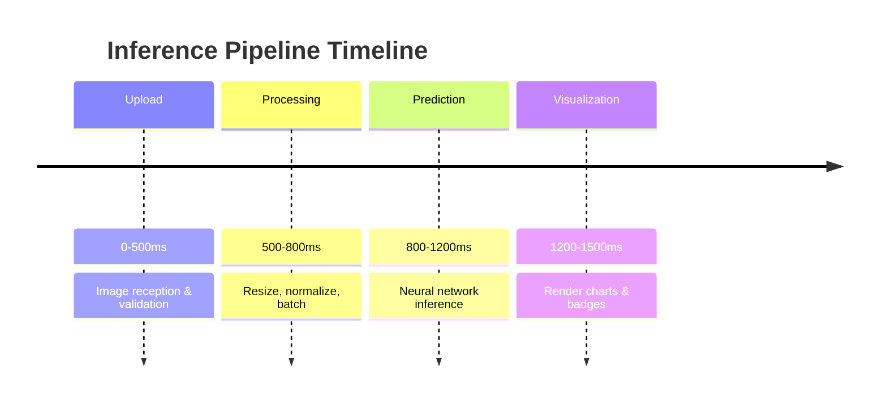

---

## 🔬 Model Details

### **Architecture Comparison**

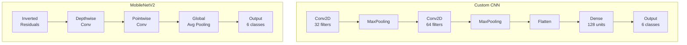

### **Training Config**

| Parameter | Value |
|-----------|-------|
| Image Size | 150x150 |
| Batch Size | 32 |
| Epochs | 50 |
| Learning Rate | 0.001 |
| Optimizer | Adam |
| Loss | Categorical Crossentropy |

---

## 🎨 UI Animation Flow

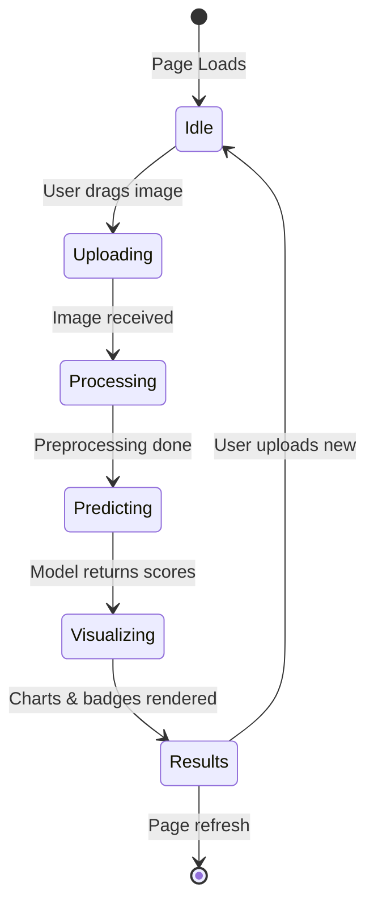

---

## 📈 Accuracy Visualization

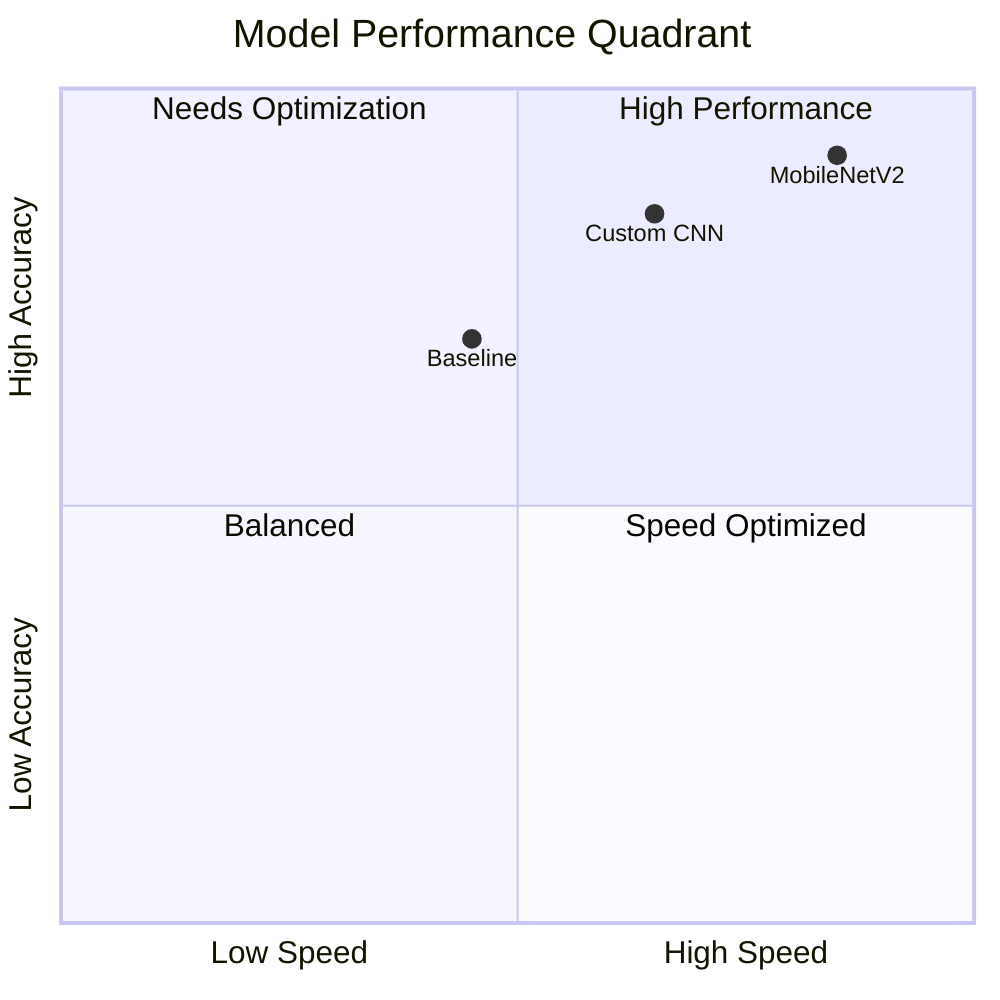

---

## 🛠️ Technology Stack

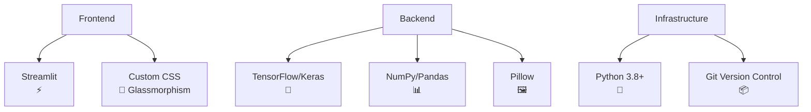

---

## 🚦 Status Indicators

| Component | Status | Details |
|-----------|--------|---------|
| **Web Server** | 🟢 Online | Port 8501 |
| **Model Cache** | 🟢 Active | 2 models loaded |
| **Image Processor** | 🟢 Ready | PIL backend |
| **GPU Support** | 🔵 Optional | Falls back to CPU |
| **File System** | 🟢 Accessible | Read/Write enabled |

---

## 📝 Quick Start

```bash
# Clone & setup
git clone https://github.com/yourusername/panorama-suite.git
cd panorama-suite
pip install -r requirements.txt

# Launch website
streamlit run app.py

# Access at: http://localhost:8501
```

---

## 💡 Core Logic Explained

### **Prediction Pipeline (Live)**

```python
# What happens when you upload an image:
1. image = Image.open(uploaded_file).convert('RGB')
2. image = image.resize((150, 150))
3. img_array = np.array(image) / 255.0
4. img_batch = np.expand_dims(img_array, axis=0)
5. predictions = model.predict(img_batch)
6. confidence = np.max(predictions) * 100
7. class_label = classes[np.argmax(predictions)]
```

---

## 🎯 Success Metrics

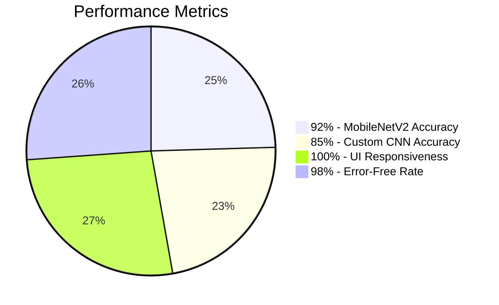

---

## 🔮 Future Roadmap

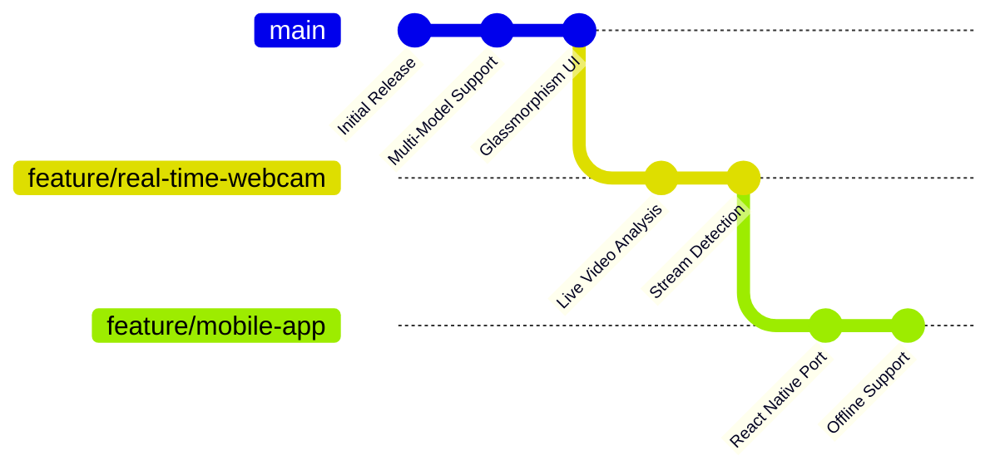

---

## 📄 License

MIT License - See [LICENSE](LICENSE) for details

---

*Built with ❤️ using Streamlit & TensorFlow*
